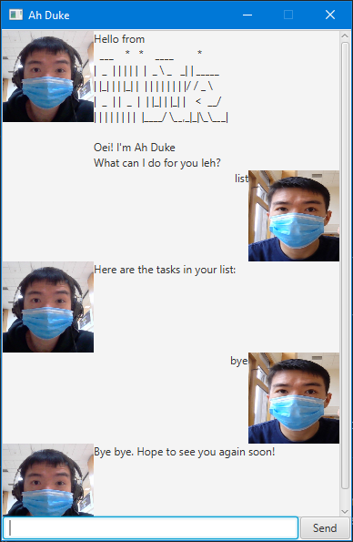

# Ah Duke project

This is a project folk from Duke project Template. 

It's named after the Java mascot _Duke_. Given below are instructions on how to use it.

## Usage
You need Java 11 installed to run _Ah Duke_, the latest JAR can be located at:
https://github.com/lamyongxian/duke/releases/latest

To run as command line application:
```
> java -jar YongXian.jar -c
```
   ```
    Hello from
      ___    *   *    ____        *
    |  _  | | | | |  |  _ \ _   _| | _____
    | |_| | | |_| |  | | | | | | | |/ / _ \
    |  _  | |  _  |  | |_| | |_| |   <  __/
    | | | | | | | |  |____/ \__,_|_|\_\___|
    
        ____________________________________________________________
        Oei! I'm Ah Duke
        What can I do for you leh?
        ____________________________________________________________
   ```

To run as GUI application, simply double-click the JAR file or execute:
```
> java -jar YongXian.jar
```


## Setting up in Intellij

Prerequisites: JDK 11, update Intellij to the most recent version.

1. Open Intellij (if you are not in the welcome screen, click `File` > `Close Project` to close the existing project dialog first)
1. Set up the correct JDK version, as follows:
   1. Click `Configure` > `Structure for New Projects` and then `Project Settings` > `Project` > `Project SDK`
   1. If JDK 11 is listed in the drop down, select it. If it is not, click `New...` and select the directory where you installed JDK 11
   1. Click `OK`
1. Import the project into Intellij as follows:
   1. Click `Open or Import`.
   1. In the project directory, and pick `build.gradle`. Let gradle sync complete.
   1. If asked, choose Open as Project (not Open as File).
   1. After importing is complete, you will see the Gradle Toolbar in the IDEA interface.
1. To run project in Intellij, 

    1. For GUI mode, locate the `src/main/java/duke/io/Launcher.java` file, right-click it, and choose `Run Launcher (GUI)`. 
    Alternatively, locate and run `Launcher (GUI)` in the top Navigation Bar.
    1. For Command Line mode, locate and run `Launcher (Command Line)` in the top Navigation Bar.


